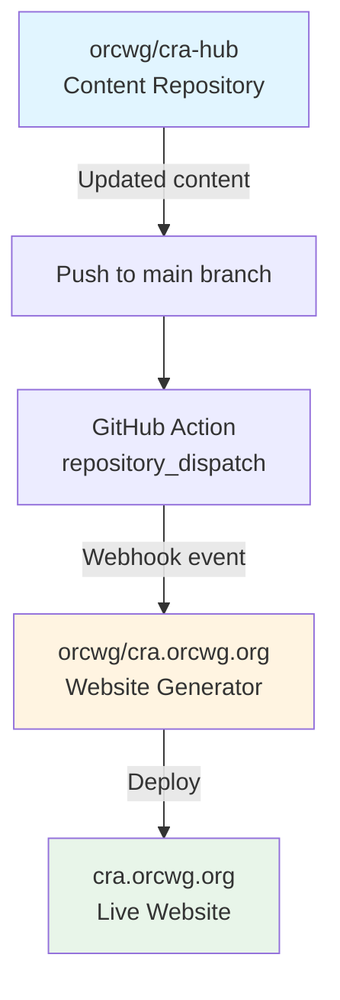

# cra.orcwg.org

Eleventy-based static site generator that creates a FAQ website for ORC WG's CRA Hub at [cra.orcwg.org](https://cra.orcwg.org/). The site consumes FAQ content from an external GitHub repository and generates a categorized FAQ website.

## Development Setup

### Prerequisites

- Node.js
- npm

### Installation

```bash
git clone https://github.com/orcwg/cra.orcwg.org.git
cd cra.orcwg.org
npm install
```

### Build Commands

- **`npm run serve`** - Start development server with live reload and cache update
- **`npm run watch`** - Watch for file changes and rebuild (no cache update)
- **`npm run build`** - Build the production site with cache update
- **`npm run update-cache`** - Manually update external content cache

## Architecture

This is an Eleventy site that acts as a content processor and renderer for external FAQ content rather than managing content locally. The site uses a **semantic HTML-first architecture** with minimal component classes and CSS-only interactions.

### Design Philosophy

- **Semantic HTML Elements**: Uses native HTML5 elements (`<details>`, `<summary>`, `<aside>`, `<article>`) with minimal class names
- **CSS-Only Interactions**: Accordions and animations use native browser features without JavaScript
- **Component Independence**: Components are self-contained and don't rely on parent context
- **Modern CSS Features**: Leverages `color-mix()`, `:has()`, `:empty`, grid template rows, and CSS Custom Properties
- **Accessibility First**: Native HTML semantics provide built-in keyboard navigation and screen reader support

### CSS Architecture

The site uses a **hybrid approach** combining semantic HTML selectors with light component classes:

**Semantic Elements:**

- `<header class="site-header">` - Site header with flexbox layout
- `<nav class="site-nav">` - Navigation menu
- `<main>` - Main content area
- `<footer>` - Site footer with grid layout
- `<aside>` - Warnings and disclaimers (styled automatically)
- `<blockquote>` - Minimal italic quotes

**Component Classes:**

- `.section-card` - White boxes for FAQ content and list sections
- `.section-intro` - Light gray introductory text boxes
- `.card-grid` - Responsive card grids (with `.half-width` variant)
- `.link-list` - FAQ link lists with hover states
- `.faq-accordion-item` - Native `<details>` with CSS animations

**Utility Classes:**

- `.badge` - Status indicators with semantic color variants
- `.info`, `.success`, `.warning`, `.danger`, `.important` - Semantic colors using `color-mix()`

### Content Flow

1. **External Content** - FAQ content is maintained in the [`orcwg/cra-hub`](https://github.com/orcwg/cra-hub) repository
2. **Cache Update** - The `update-cache.sh` script clones/updates external content into `_cache/faq/`
3. **Data Processing** - `src/_data/data.js` orchestrates the complete data pipeline:
   - **Text Processing**: Markdown to plain text conversion for titles and summaries
   - **File Operations**: Parsing markdown files with frontmatter
   - **FAQ Processing**: Extract questions, answers, and metadata from FAQ markdown files
   - **Guidance Request Processing**: Parse pending guidance request documents
   - **Curated List Processing**: Load and normalize README.yml files from FAQ subdirectories
   - **Authors Processing**: Load AUTHORS.md content
   - **Cross-referencing**: Cross-reference FAQs with guidance requests and lists
   - **Permalink Generation**: URLs computed once in data layer, not reconstructed in templates
4. **Template Rendering** - Nunjucks templates consume processed data using semantic HTML components
5. **Site Generation** - Final site is output to `_site/` for deployment

### Content Types

- **FAQs**: Questions and answers with status tracking (`draft`, `approved`, `pending guidance`)
- **Guidance Requests**: Items awaiting EU Commission clarification

### Data Pipeline Details

The data processing pipeline in `src/_data/data.js` is organized into modular sections:

1. **Utility Functions**
   - Text processing: Convert markdown to plain text for page titles
   - File operations: Parse markdown files with frontmatter using gray-matter

2. **Content Processors**
   - **FAQs**: Extract questions from `#` headings, answers from subsequent content, status badges, and GitHub edit links
   - **Guidance Requests**: Parse pending guidance documents, extract titles and "Guidance Needed" sections
   - **Curated Lists**: Load README.yml files from FAQ subdirectories, normalize FAQ references
   - **Authors**: Load AUTHORS.md content from the FAQ repository

3. **Relationship Building**
   - Link FAQs to their related guidance requests via `guidance-id` frontmatter field
   - Bidirectionally connect curated lists with their referenced FAQs
   - Each FAQ knows which lists include it; each list knows its FAQs

### Curated Lists

- README.yml files in FAQ subdirectories define curated FAQ collections
- Each README.yml file creates a new list page at `/lists/{category}/`
- Lists reference FAQs by filename (short form) or category/filename (long form)
- FAQ references are automatically normalized to category/filename format
- Lists maintain bidirectional links with FAQs for navigation
- Lists are displayed using native HTML `<details>` accordions for compact navigation

### FAQ Components

The site uses two reusable FAQ components with minimal markup:

- **`faq-list-simple.njk`** - Simple link lists using semantic `<ul class="link-list">`
  - Displays FAQ questions as clickable links
  - Shows status badges when present
  - Used in main FAQ list page and list indexes

- **`faq-accordion.njk`** - Native `<details>` accordions with CSS-only animations
  - Uses HTML5 `<details>` and `<summary>` elements
  - Exclusive accordion behavior via `name="faq-accordion"` attribute
  - Smooth open/close animations using CSS grid template rows
  - No JavaScript required for accordion functionality
  - Used in curated lists for inline FAQ browsing

### Component Structure

Components follow a consistent data pattern:

```javascript


```

### Site Configuration

- Global site settings in `src/_data/site.json`
- Navigation menu configuration (used in header, homepage cards, and footer)
- List ordering controlled via `listOrder` array
- Footer content structured as sections with titles and lists

## External Dependencies

### Primary Content Source

- **Repository**: [`orcwg/cra-hub`](https://github.com/orcwg/cra-hub)
- **Purpose**: Contains all FAQ content and guidance requests in markdown format
- **Update**: Automatically pulled during builds via `update-cache.sh`

### Technology Stack

- **Static Site Generator**: Eleventy 3.x
- **Template Engine**: Nunjucks
- **Markdown Processing**: markdown-it with GitHub alerts plugin
- **Diagram Support**: Mermaid.js (for rendering code blocks with `language-mermaid`)
- **CSS Architecture**:
  - Semantic HTML-first approach with minimal utility classes
  - CSS Custom Properties for theming
  - Modern CSS features: `color-mix()`, `:has()`, `:empty`, grid template rows
  - CSS-only accordions using native `<details>` elements
- **JavaScript**: Minimal - only used for Mermaid diagram initialization (`src/assets/js/site.js`)

## Development Resources

- **Style Guide**: Visit `/style-guide/` to preview all components, design patterns, and semantic HTML structures used throughout the site. The style guide is excluded from collections but available during development.

### Key Components

- `.section-card` - White content boxes with shadow and border
- `.section-intro` - Light gray intro/description sections
- `.card-grid` - Responsive grid layout for navigation cards
- `.card` - Individual cards with hover effects and animated arrows
- `.link-list` - Styled FAQ link lists with badge support
- `.faq-accordion-item` - Native `<details>` elements with CSS animations
- Semantic color utilities: `.info`, `.success`, `.warning`, `.danger`, `.important`

## Deployment

The site is deployed to GitHub Pages at [cra.orcwg.org](https://cra.orcwg.org/) with automatic updates triggered by changes to the content repository.

### Deployment Architecture

This repository (`cra.orcwg.org`) acts as the **website generator**, while [`orcwg/cra-hub`](https://github.com/orcwg/cra-hub) is the **content source**. The two repositories work together through an automated workflow:



### Automatic Update Workflow

When content is pushed to the `main` branch of `orcwg/cra-hub`, a GitHub Action automatically triggers a rebuild of this website:

**In `orcwg/cra-hub` repository:**

```yaml
name: Notify cra.orcwg.org repository on Push

on:
  push:
    branches:
      - main

jobs:
  dispatch-to-cra-website:
    runs-on: ubuntu-latest
    steps:
      - name: Send repository dispatch to cra.orcwg.org
        run: |
          curl -L \
            -X POST \
            -H "Accept: application/vnd.github+json" \
            -H "Authorization: Bearer ${{ secrets.WEBSITE_DISPATCH_TOKEN }}" \
            -H "X-GitHub-Api-Version: 2022-11-28" \
            https://api.github.com/repos/orcwg/cra.orcwg.org/dispatches \
            -d '{"event_type":"cra-hub-update"}'
```

This workflow:

1. Listens for pushes to the `main` branch in `cra-hub`
2. Sends a `repository_dispatch` event with type `cra-hub-update` to this repository
3. Uses a GitHub token (`WEBSITE_DISPATCH_TOKEN`) with permissions:
   - **Repository access**: Only `orcwg/cra.orcwg.org`
   - **Contents**: Read & Write (required for repository_dispatch)
   - **Metadata**: Read (auto-selected)

**In this repository (`cra.orcwg.org`):**

The website listens for the `repository_dispatch` event and rebuilds automatically:

1. Pulls latest content from `cra-hub` via `update-cache.sh`
2. Processes FAQ data through the Eleventy data pipeline
3. Generates static HTML pages
4. Publishes to GitHub Pages at `https://cra.orcwg.org`

### Manual Deployment

For manual deployments or testing, the build process:

1. Runs `update-cache.sh` to clone/update `cra-hub` into `_cache/`
2. Extracts repository contributors from git history
3. Processes FAQ data from cloned repository via `src/_data/data.js`
4. Generates static HTML pages using Eleventy
5. Outputs complete site to `_site/` directory

### Local Development

When developing locally:

```bash
# Start development server (updates cache and serves with live reload)
npm run serve

# Build production site (updates cache and builds)
npm run build

# Manually update content cache only
npm run update-cache
```

The `update-cache.sh` script:

1. Clones or pulls the latest `cra-hub` content into `_cache/`
2. Extracts unique contributors from git commit history
3. Saves contributor data to `src/_data/repoContributors.json`

## License

This project is licensed under the terms of the Apache License Version 2.0.

SPDX-License-Identifier: Apache-2.0
